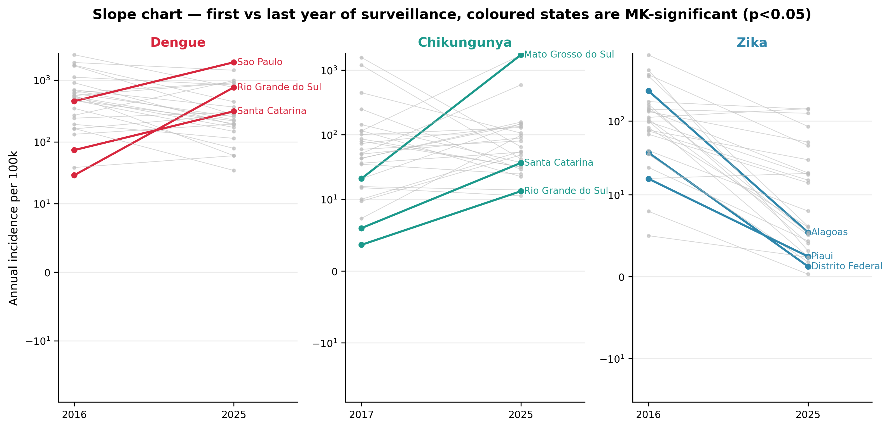
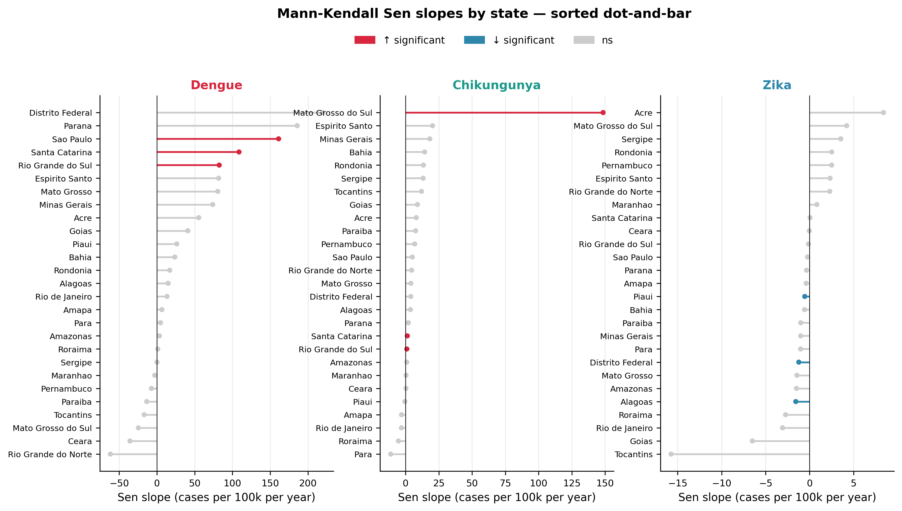
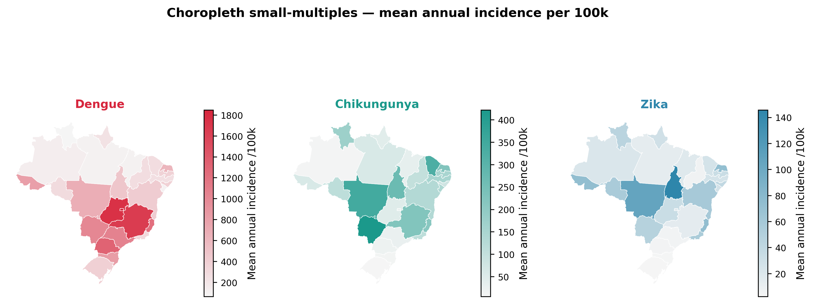
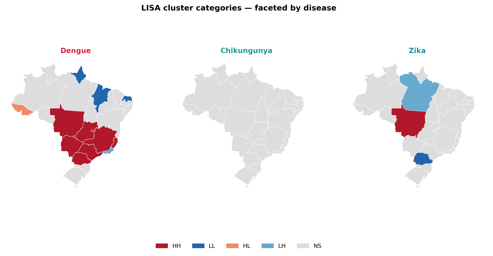
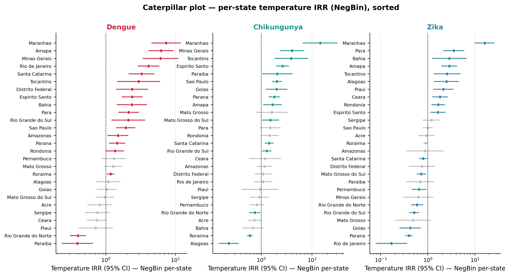

# Arbovirus Surveillance in Brazil — Results Summary (Normalized DB pipeline)

**Run date:** 2026-05-19
**Data window:** 2016–2025 (CHIKV starts 2017; ZIKV and DENV start 2016)
**Spatial unit:** 27 Brazilian federative units
**Temporal unit:** monthly

All scripts in `normalized_results/` were executed via `run_all.py` (8/8 pipelines succeeded).

---

## 1. Data scope

| Disease | Years | States | Monthly obs | Total cases |
|---|---|---|---|---|
| Dengue | 2016–2025 | 27 | 3,240 | 16,347,701 |
| Chikungunya | 2017–2025 | 27 | 2,916 | 2,012,359 |
| Zika | 2016–2025 | 27 | 3,240 | 546,633 |

Mean annual incidence per 100,000 inhabitants: **Dengue ≈ 624**, **Chikungunya ≈ 131**, **Zika ≈ 40**.

---

## 2. Descriptive statistics — 95% CIs (normal-approx vs bootstrap)

Confidence intervals on the mean of monthly counts and incidence (pooled across all states × months), with 1,000-resample percentile bootstrap shown alongside the original normal-approximation CIs.

### Mean monthly cases
| Disease | Mean | Normal-approx 95% CI | Bootstrap 95% CI | n |
|---|---|---|---|---|
| DENV | 4,794.7 | (4,025.3 – 5,564.1) | (4,282.1 – 6,036.4) | 3,888 |
| CHIKV | 691.1 | (596.3 – 785.8) | (603.4 – 786.1) | 2,912 |
| ZIKV | 169.9 | (138.4 – 201.4) | (139.3 – 203.9) | 3,218 |

### Mean monthly incidence per 100,000
| Disease | Mean | Normal-approx 95% CI | Bootstrap 95% CI | n |
|---|---|---|---|---|
| DENV | 50.28 | (45.85 – 54.71) | (47.15 – 57.25) | 3,888 |
| CHIKV | 10.91 | (9.79 – 12.03) | (9.82 – 11.98) | 2,912 |
| ZIKV | 3.34 | (2.94 – 3.73) | (2.95 – 3.74) | 3,218 |

**Note.** For DENV, the bootstrap CI is shifted ~250 cases higher than the normal-approx CI — the underlying distribution is heavily right-skewed (large epidemic peaks), so the bootstrap captures the asymmetry better. CHIKV and ZIKV CIs are nearly identical between methods.

---

## 3. Temporal trend — Mann-Kendall on annual incidence per state

| Disease | Significant states (p<0.05) | Increasing | Decreasing | No trend |
|---|---|---|---|---|
| Dengue | 3 / 27 | 3 | 0 | 24 |
| Chikungunya | 3 / 27 | 3 | 0 | 24 |
| Zika | 3 / 27 | 0 | 3 | 24 |

**Strongest significant trends:**

- **Dengue ↑** Rio Grande do Sul (τ=0.73, Sen=+82.6/yr), Santa Catarina (τ=0.69, Sen=+108.8/yr), São Paulo (τ=0.51, Sen=+161.2/yr) → southward expansion of Dengue.
- **Chikungunya ↑** Santa Catarina (τ=0.78), Mato Grosso do Sul (τ=0.61), Rio Grande do Sul (τ=0.61) → southern emergence.
- **Zika ↓** Alagoas, Distrito Federal, Piauí (all τ=−0.56, p=0.032) → post-2016 epidemic decline.

The majority of states show no significant trend, consistent with the high inter-annual epidemic volatility typical of arboviruses.

---

## 4. Climate correlations — Spearman (lags 0–2 months)

| Disease | Variable | Tests | Significant (α=0.05) | Mean ρ |
|---|---|---|---|---|
| Dengue | Temp | 81 | 40 | +0.17 |
| Dengue | Rain | 81 | 10 | −0.02 |
| Chikungunya | Temp | 81 | 43 | +0.15 |
| Chikungunya | Rain | 81 | 19 | +0.02 |
| Zika | Temp | 81 | 27 | +0.07 |
| Zika | Rain | 81 | 14 | +0.02 |

**Interpretation.** Temperature is the dominant climate driver across all three diseases (positive direction); rainfall correlations are weaker and more spatially heterogeneous. Explicit 2-month rain lag (`rain[t] → incidence[t+2]`): only 3–5 states per disease show a significant correlation, suggesting no national-level rain-lag signal.

---

## 5. Spatial autocorrelation

### Global Moran's I (point-based KNN k=4, 999 permutations)
| Disease | I | p_sim | Significant |
|---|---|---|---|
| Dengue | **+0.56** | 0.002 | ✅ strong positive clustering |
| Chikungunya | −0.04 | 0.49 | ❌ no spatial structure |
| Zika | −0.01 | 0.37 | ❌ no spatial structure |

The geospatial pipeline (polygon-based KNN k=5) confirms: Dengue I=+0.52, p=0.001; the other two diseases show no significant spatial autocorrelation.

### LISA clusters (Local Moran's I) — significant clusters

**Dengue (8 HH high-incidence clusters):**
Centro-Oeste + Sudeste/Sul axis — Distrito Federal, Espírito Santo, Goiás, Mato Grosso, Mato Grosso do Sul, Minas Gerais, Paraná, São Paulo.
**Dengue LL low-incidence clusters:** Amapá, Maranhão, Rio Grande do Norte (Norte/Nordeste).

**Chikungunya:** no significant local clusters — disease is spatially diffuse.

**Zika:** isolated HH (Mato Grosso) and LL (Paraná) only.

---

## 6. Count-data regression (GLM) — pooled national models with state fixed effects

Model: `Cases ~ Temp_Avg + Rain_mm + C(Location_Name) + offset(log Population)`.
Per-state and lagged specifications are also exported (see `outputs/glm_*_per_state.csv` and `outputs/glm_*_lagged.csv`).

### Pooled IRRs (incidence-rate ratios), all 27 states, monthly grain

| Disease | Model | Temp IRR (95% CI) | Rain IRR (95% CI) | Dispersion |
|---|---|---|---|---|
| **Dengue** | Poisson | 2.080 (2.079–2.082) | 1.008 (1.008–1.008) | φ = 19,541 |
| | Quasi-Poisson | 2.080 (1.872–2.312)*** | 1.008 (1.004–1.012)*** | φ = 19,541 |
| | **NegBin** | **2.102 (1.956–2.258)***\* | **1.007 (1.005–1.010)***\* | α = 1.69 |
| **Chikungunya** | Poisson | 1.335 (1.332–1.337) | 1.010 (1.010–1.010) | φ = 2,753 |
| | Quasi-Poisson | 1.335 (1.193–1.493)*** | 1.010 (1.005–1.015)*** | φ = 2,753 |
| | **NegBin** | **1.319 (1.238–1.407)***\* | **1.007 (1.004–1.009)***\* | α = 1.45 |
| **Zika** | Poisson | 0.898 (0.894–0.902) | 1.002 (1.002–1.002) | φ = 1,540 |
| | Quasi-Poisson | 0.898 (0.747–1.079) ns | 1.002 (0.996–1.008) ns | φ = 1,540 |
| | **NegBin** | **0.900 (0.837–0.968)*** | 1.002 (0.999–1.004) ns | α = 1.55 |

(\*\*\* p<0.001, \*\* p<0.01, \* p<0.05, ns = not significant)

### Dispersion overview (per-state models)
| Family | Median dispersion | Range |
|---|---|---|
| Poisson | φ = 765.5 | 20 – 137,354 |
| Quasi-Poisson | φ = 765.5 | 20 – 137,354 |
| Negative Binomial | α = 1.16 | 0.47 – 4.05 |

### Interpretation

- **Poisson is inappropriate** for these data: residual dispersion is 20× to 137,000× higher than the Poisson assumption (φ=1). All its p-values are spuriously near zero because SEs are too small.
- **Quasi-Poisson and Negative Binomial agree** on direction, magnitude, and significance — both correctly inflate uncertainty. **NegBin is preferred** for publication (proper likelihood, AIC-comparable, well-estimated α≈1.5).
- **Dengue**: every 1°C of monthly mean temperature is associated with **~2.1× the case rate**, holding state fixed; 10 mm extra rain → ~7% higher rate.
- **Chikungunya**: temperature effect smaller (+32% per °C) but still highly significant.
- **Zika**: weak *negative* temperature association (IRR 0.90, p≈0.004 in NegBin) and no rain effect — consistent with Zika's epidemic having peaked in 2015–2016 and declined irrespective of climate.

Per-state breakdowns (in `outputs/glm_negbin_per_state.csv`) show 15/27 states with significant temperature effect for Chikungunya and 18/27 for Dengue and Zika; rain effects are significant in 6–11/27 states depending on disease.

---

## 7. Methodological notes

1. **Column rename:** the original `Annual_Incidence` column in the normalized DB was actually monthly incidence per 100 k inhabitants. Renamed to `Monthly_Inc_per100k` in `normalized_results/db/normalized_fact_cases.csv`. Values unchanged.
2. **CI 95%:** retained the normal-approximation CIs from `db/ci_95_*.csv` and added bootstrap CIs in `outputs/bootstrap_ci_95_*.csv`. Both are valid for n>30 by CLT; bootstrap is more robust to right-skew (notable for Dengue).
3. **Year window:** all diseases truncated to ≥2016 for comparability; CHIKV naturally begins 2017.
4. **Independence caveat:** monthly observations within a state are autocorrelated. CIs and GLM SEs assume independence and may be slightly anti-conservative; clustered/HAC SEs or mixed-effects extensions are recommended for inference-critical claims.
5. **Spatial weights:** KNN k=4 (point-based pipeline) and KNN k=5 (polygon-based geospatial pipeline). Queen contiguity was attempted first in the geo pipeline but Brazilian island territories triggered the KNN fallback.

---

## 8. Output files

### Generated artefacts (35 in `outputs/`, 16 in `figures/`)

**Statistical tables**

| File | Contents |
|---|---|
| `outputs/py_statistical_results.xlsx` | Annual incidence, Mann-Kendall, Spearman, Global Moran, Rain Lag-2 |
| `outputs/geo_spatial_stats.xlsx` | Mean incidence, MK, LISA clusters, Global Moran |
| `outputs/ci_comparison.xlsx` | Normal-approx vs bootstrap CIs side-by-side |
| `outputs/glm_poisson_results.xlsx` | Poisson — 3 specs + diagnostics |
| `outputs/glm_quasi_poisson_results.xlsx` | Quasi-Poisson — 3 specs + diagnostics |
| `outputs/glm_negbin_results.xlsx` | Negative Binomial — 3 specs + diagnostics |
| `outputs/glm_*_per_state.csv` | Per-state GLM coefficients (243 rows each) |
| `outputs/glm_*_lagged.csv` | Per-state GLMs with Temp/Rain lag-0/1/2 (567 rows each) |
| `outputs/glm_*_pooled_fe.csv` | Pooled national GLM with state fixed effects (87 rows each) |

**Plots** (`outputs/*.png`)
- `py_01`–`py_10` — main pipeline plots
- `geo_01`–`geo_06` — geospatial maps
- `Dengue_*`, `Chikungunya_*`, `Zika_*` — GraphPad-converted clinical/demographic plots

**Composite figures** (`figures/Figure*.png`, 11 files) — publication-ready panels.
Figure 6 (maps) is split into four standalone figures: `Figure6a_choropleth_mean`,
`Figure6b_jenks_classification`, `Figure6c_temporal_maps`, `Figure6d_lisa_trend`.

**Alternative views** (`figures/trend0*`, `figures/spat0*`, `figures/glm02_*`) — five
selected alternative encodings of the main findings (slope chart, Sen-slope
dot-and-bar, faceted choropleth, faceted LISA map, per-state IRR caterpillar).
Regenerate with `python3 pipelines/alt_results.py`. See `alt_results/README.md`
for the mapping between each alternative and the original it pairs with.

---

## 9. Quick takeaways

1. **Dengue dominates** by case volume (16.3 M cases) and is the only arbovirus with significant **spatial clustering** (Moran's I=0.56) and a positive temperature signal (~2× rate per °C).
2. **Chikungunya is emerging in the southern states** (Santa Catarina, Rio Grande do Sul, Mato Grosso do Sul) — clear positive Mann-Kendall trends.
3. **Zika has declined** since 2016 (significant decreasing trends in Alagoas, DF, Piauí) and shows weak/inverse climate association — the 2015–2016 epidemic has receded.
4. **Negative Binomial is the appropriate model family** for these data (Poisson over-dispersion is 20× to 137,000×). Use the NegBin per-state and pooled outputs for inference.
